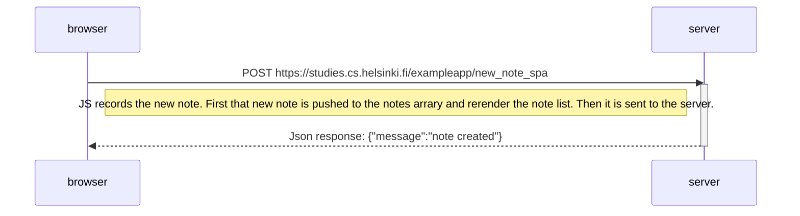

# The user creates a new node on a single page app

```mermaid
sequenceDiagram
    participant browser
    participant server
    
    browser->>server: POST https://studies.cs.helsinki.fi/exampleapp/new_note_spa
    activate server
    Note right of browser: JS records the new note. First that new note is pushed to the notes arrary and rerender the note list. Then it is sent to the server.
    server-->>browser: Json response: {"message":"note created"}
    deactivate server

```
